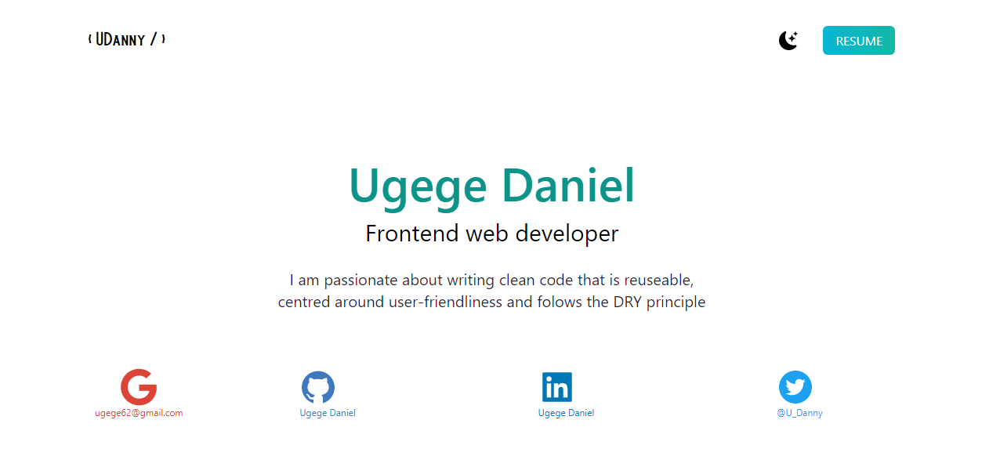
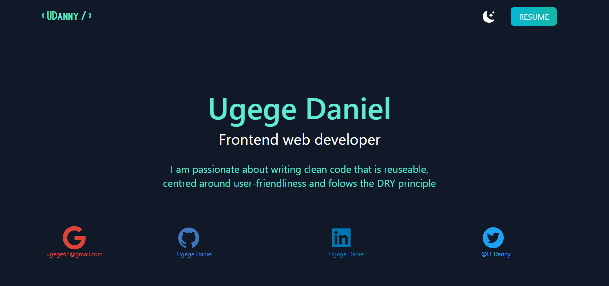

*deployed on vercel*
# Ugege Daniel Portfolio

This is a responsive Next JS app that displays recent web development projects by Ugege Daniel. Its a simple app that demostrates the basic features of the React library with Next JS.

## Table of Contents

- [App Features](#app-features)
- [Built with](#built-with)
- [Live Preview](#live-preview)
- [Required Installations](#required-installations)
- [Installation of This App](#instalation)
- [License](#license)
- [Contact](#contact)
- [Acknowledgements](#acknowledgements)

## Built with

- HTML5
- Tailwind CSS
- TypeScript
- ES Lint (Air Bnb recomended standard)
- Next-JS

## Live Preview
Find the live version [here](https://portfolio-one-chi-75.vercel.app/). 

Below is a screenshot of what it looks like in both light and dark mode

## Required Installations

Npm

Once you have installed the required packages shown on the Required Installations, proceed with the following steps :

* Clone this Repository

`
git clone https://github.com/UgegeDaniel/potfolio.git
`

* Move to the downloaded folder

`cd potfolio
`

* Install all packages

`npm install
`

* Open the app

`
npm start
`

## License
Distributed under the MIT License. 

See LICENSE for more information.

### Contact
🇳🇬 Ugege Daniel - ugege@gmail.com | [Github Account](https://github.com/UgegeDaniel) | [Twitter](https://twitter.com/home) | [Linkedin](https://linkedin.com/in/daniel-ugege-50a499227) |

### Acknowledgements
Lewis Ugege and God Almighty .
